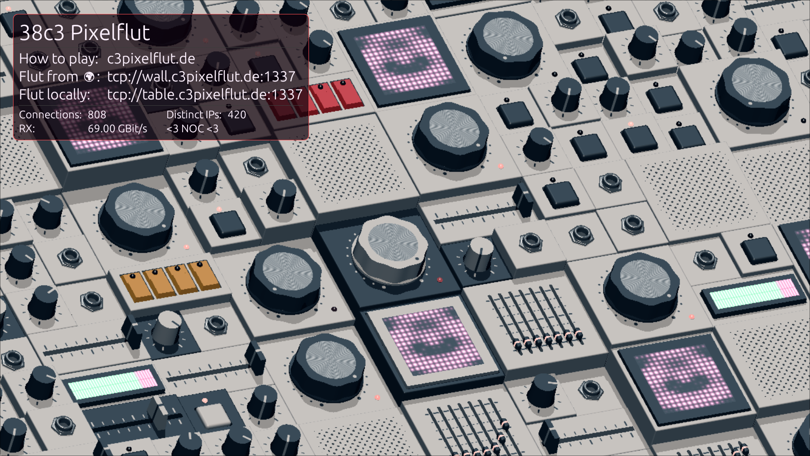

# Custom overlay for the [breakwater](https://github.com/sbernauer/breakwater) pixelflut server

This overlay was used at [38c3](https://events.ccc.de/congress/2024/infos/startpage.html). You may now use this as a template for your overlay.

## Important

Make sure you compile the overlay for the correct version and with the same compiler (**and profile!**) as breakwater.
